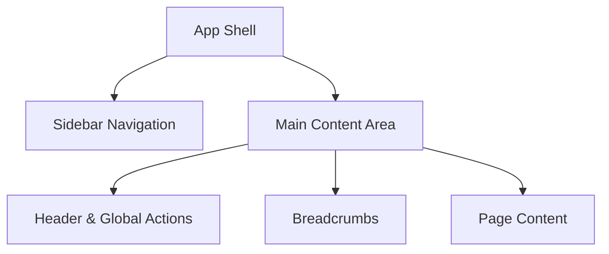

# ATS & Core HR - Design System Strategy

## 1. Global CSS Token Structure
Using **Tailwind CSS** and **shadcn/ui**, we establish a minimalist, "content-first" theme based on Zinc/Slate to reduce cognitive load while managing dense HR data.

### 1.1 Color Tokens (Tailwind/CSS Variables)
| Token | Light Mode (Hex) | Dark Mode (Hex) | Usage |
|-------|------------------|-----------------|-------|
| `--background` | `#FFFFFF` | `#09090B` (zinc-950) | Main app background |
| `--foreground` | `#09090B` (zinc-950) | `#FAFAFA` (zinc-50) | Primary text |
| `--card` | `#FFFFFF` | `#09090B` | Card/Panel background |
| `--muted` | `#F4F4F5` (zinc-100) | `#27272A` (zinc-800) | Secondary backgrounds, subtle fills |
| `--muted-foreground` | `#71717A` (zinc-500) | `#A1A1AA` (zinc-400) | Secondary text, helper text |
| `--primary` | `#18181B` (zinc-900) | `#FAFAFA` (zinc-50) | Primary buttons, active states |
| `--border` | `#E4E4E7` (zinc-200) | `#27272A` (zinc-800) | Dividers, borders |

### 1.2 Semantic Colors (Status & Feedback)
HR systems require distinct, accessible semantic colors.
- **Success/Active**: `--success` -> `#22C55E` (green-500). Used for 'ACTIVE' employees.
- **Warning/On Leave**: `--warning` -> `#F59E0B` (amber-500). Used for 'ON_LEAVE'.
- **Destructive/Inactive**: `--destructive` -> `#EF4444` (red-500). Used for 'INACTIVE'.
- **Info**: `--info` -> `#3B82F6` (blue-500).

### 1.3 Typography
- **Font Family**: Inter or Geist (sans-serif) for clean readability.
- **Data Tables & IDs**: Use `tabular-nums` class for CPF, CNPJ, Cost Center Codes, and currency to prevent layout shifting.
- **Scale**:
  - `h1`: `text-3xl font-bold tracking-tight`
  - `h2`: `text-2xl font-semibold tracking-tight`
  - `body`: `text-base leading-relaxed`
  - `small`: `text-sm text-muted-foreground`

## 2. Core Layout Structure

An enterprise ATS/HR system requires persistent navigation to retain context across deep triad structures (Companies -> Workplaces -> Employees).



### 2.1 Sidebar Navigation
- **Placement**: Fixed on the left (e.g., `w-64`), collapsible to icon-only for more screen real estate on smaller devices.
- **Hierarchy**: Grouped links (e.g., "Core HR": Employees, Cost Centers; "Organization": Companies, Workplaces).
- **Active State**: Visual highlight (e.g., `bg-muted text-primary font-medium`) to clearly indicate the current module.

### 2.2 Header
- **Placement**: Sticky at the top of the main content area (`h-14` or `h-16`).
- **Contents**: User profile dropdown, global search, and notification bell.
- **Styling**: `border-b bg-background/95 backdrop-blur` for a modern, glass-like effect that maintains context when scrolling.

### 2.3 Breadcrumbs
- **Crucial for Spatial Orientation**: Deep nesting (e.g., `Company > Workplace > Employee Profile`) necessitates breadcrumbs.
- **Usage**: Displayed directly below the header, above the page title. Using `shadcn/ui` Breadcrumb component for accessibility.

## 4. Data Table Component Specs

Data density is paramount. HR managers need to scan employees across the triad (Companies, Workplaces, Cost Centers).

### 4.1 Design Rules
- **Spacing System**: Use the `ui-ux-pro-max` 4/8dp scale. Use `size="sm"` for shadcn table cells (e.g., `py-2 px-3`) to increase density without sacrificing readability.
- **Horizontal Scrolling**: Allowed only if sticky columns are implemented (e.g., sticking the Employee Name to the left).
- **Pagination & Virtualization**: Use server-side pagination for >100 records.

### 4.2 Key Table Elements
1. **Column Headers**: Must support sorting (indicator icons) and filtering.
2. **Status Badges**: Use `shadcn/ui` Badge component with semantic colors.
3. **Row Actions**: Placed on the far right as an overflow menu (`...`) to conserve space (Edit, View Profile, Change Status).
4. **Empty State**: Never show a blank table. Provide an illustration and a primary CTA ("Add your first employee").

### 4.3 Example Implementation Structure
```tsx
<div className="space-y-4">
  <div className="flex justify-between items-center">
    <Input placeholder="Search employees..." className="max-w-sm" />
    <Button>+ Add Employee</Button>
  </div>
  <div className="rounded-md border">
    <Table>
      {/* Table Headers (Sortable) */}
      {/* Table Body (Dense padding, semantic badges) */}
    </Table>
  </div>
  <Pagination />
</div>
```
